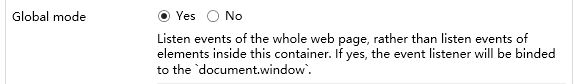

## KeyEventListeningContainer

A mendix pluggable widget (container) to listen Key events. The events can be from the DOM elements inside this container or from the `document.window`.

## Features

1. Very easy to use in Mendix. No pure code needed. 
2. Can listen key events both locally(from the elements inside the container) and globally(from the `document.window`). See the 'A' part of the picture below.
3. You can add as many events as you want, if you want each listener for each type of key event. See the 'B' part of the picture below.
4. Modifier keys are supported. e.g. SHIFT, ALT, CTRL, META.See the 'C' part of the picture below.

## Usage

1. Add this `KeyEventListeningContainer` pluggable widget into your Mendix Project.
    1. Download the latest mpk file from [here](https://github.com/zjh1943/mendix-key-event-listening-container/releases).
    3. Copy the mpk file to `{YourMendixProjectFolder}/widgets/`.
    4. Open your mendix project with the Mendix Studio Pro, click `Menu > App > Synchronize App Directory`.
2. Add `KeyEventListeningContainer` widget into the page.
3. Set properties of the `KeyEventListeningContainer` container widget. See next chapter about properties.
4. Add other widgets into the `KeyEventListeningContainer` container widget.

## Properties

### Global mode

Options:
1. Yes. Listen events of the whole web page. If yes is selected, the event listener will be binded to the `document.window`.
2. No. Listen events of the DOM elements inside this container. I no is selected, the event listener will be binded to this container. In this mode, you must put some input widgets in this container before you can recieve any keyboard event.

### Key Event Listeners

Add each event listener for one kind of key event. 

### Handlers

1. `Key`. Which key in the keyboard do you want to listen. e.g. 'q', 'Q', 'Enter'... Here is the whole key list: https://developer.mozilla.org/en-US/docs/Web/API/UI_Events/Keyboard_event_key_values
2. `On key event`. The action you want to do when receive the keyboard event.
3. `Event type`. Want to listen key up event or key down event.
4. Modifiler keys. support: SHIFT, ALT, CTRL, META.
    * Ignore. No matter this modifier key is pressed or not, the action will be triggered.
    * Yes. If only this modifier key is pressed, the action will be triggered.
    * No. If only this modifier key is not pressed, the action will be triggered.

## Issues, suggestions and feature requests
[link to GitHub issues](https://github.com/zjh1943/mendix-pluggable-widget-key-event-listening-container/issues)

## Development and contribution

1. Clone the repostory. `git clone https://github.com/zjh1943/mendix-pluggable-widget-key-event-listening-container`
2. `cd ./mendix-key-event-listening-container`
3. Open the `package.json` file . Change the `projectPath` to the root directory of your mendix project.
4. In the folder `./mendix-key-event-listening-container`, Run `npm start` to watch for code changes. On every change:
    - the widget will be bundled;
    - the bundle will be included in a `dist` folder in the root directory of the project;
    - the bundle will be included in the `deployment` and `widgets` folder of the Mendix test project.
4. Open your mendix project with the Mendix Studio Pro, click `Menu > App > Synchronize App Directory`.

